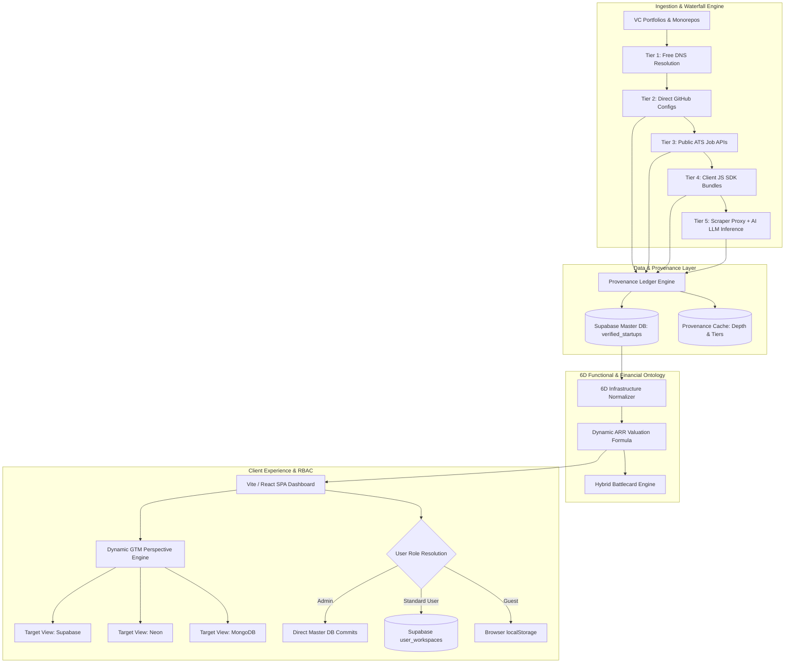
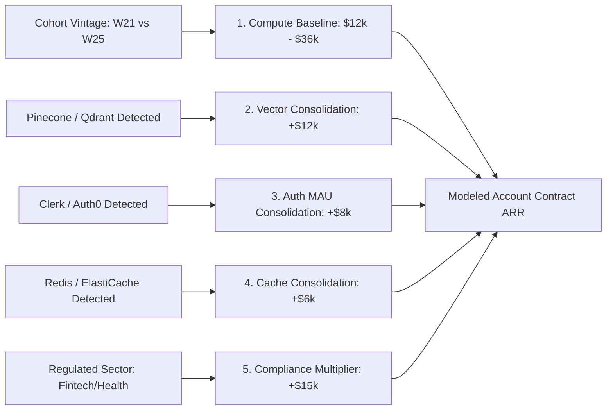
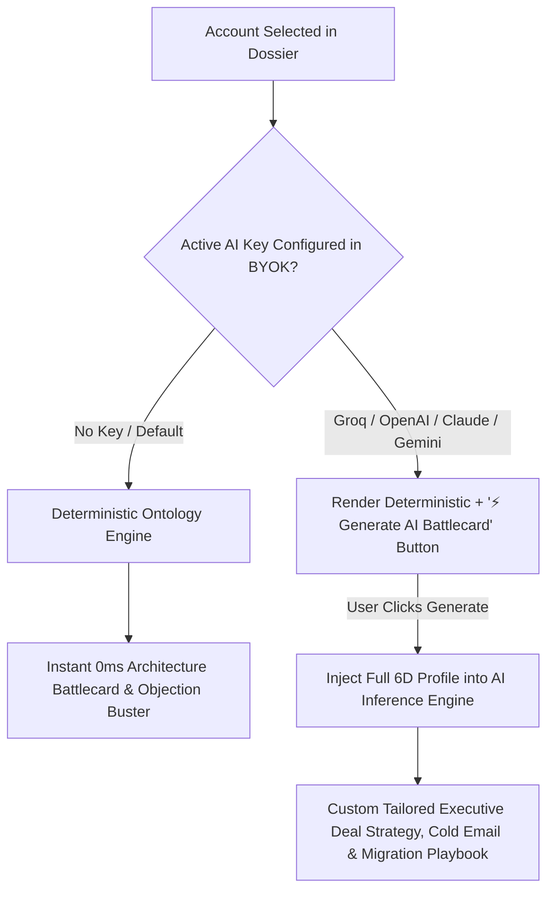
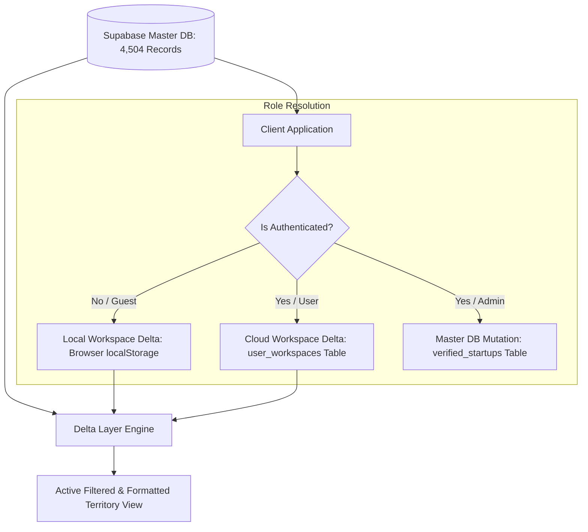

# StackPulse Enterprise System Architecture

**StackPulse** is a high-density, real-time Go-To-Market (GTM) Intelligence and Account Topology Engine built for Enterprise Infrastructure and Developer Tool teams (specifically optimized for Supabase GTM, Neon, PlanetScale, MongoDB Atlas, and ClickHouse).

It monitors **4,504 venture-backed startups** across Y Combinator, a16z Speedrun, and Sequoia Arc, extracting their internal database, caching, analytics, and vector infrastructure with high architectural fidelity.

---

## 1. High-Level System Architecture



---

## 2. The 6-Dimension Functional Infrastructure Ontology

Rather than storing unstructured text tags, StackPulse standardizes each account into **6 orthogonal, typed infrastructure dimensions**:

```
┌────────────────────────────────────────────────────────────────────────────────────────┐
│ 🏛️ Functional Infrastructure Taxonomy                                                 │
├──────────────────────────────────────┬─────────────────────────────────────────────────┤
│ Dimension                            │ Standardized Providers & Taxonomy Values        │
├──────────────────────────────────────┼─────────────────────────────────────────────────┤
│ 1. Primary Operational Database     │ PostgreSQL | Supabase | Neon | MySQL            │
│                                      │ PlanetScale | MongoDB | DynamoDB | Aurora/RDS   │
├──────────────────────────────────────┼─────────────────────────────────────────────────┤
│ 2. Vector & Embeddings Engine        │ pgvector (Native) | Pinecone | Qdrant           │
│                                      │ Weaviate | Milvus | Chroma | None               │
├──────────────────────────────────────┼─────────────────────────────────────────────────┤
│ 3. Key-Value & Caching Layer         │ Redis | Upstash | AWS ElastiCache | None        │
├──────────────────────────────────────┼─────────────────────────────────────────────────┤
│ 4. Analytics & OLAP Engine           │ ClickHouse | Snowflake | BigQuery | OpenSearch  │
├──────────────────────────────────────┼─────────────────────────────────────────────────┤
│ 5. Auth & Identity Provider          │ Supabase Auth | Clerk | Auth0 | NextAuth        │
├──────────────────────────────────────┼─────────────────────────────────────────────────┤
│ 6. Cloud Runtime & Hosting           │ Vercel | Cloudflare Workers | AWS Lambda/ECS    │
└──────────────────────────────────────┴─────────────────────────────────────────────────┘
```

---

## 3. Financial & Pricing Valuation Formula

StackPulse models account pipeline ARR dynamically based on real-world infrastructure billing metrics:

$$\text{Estimated ARR} = \text{Base Compute (Cohort Vintage)} + \sum(\text{Tool Consolidation Add-ons}) + \text{Compliance Multiplier (Sector)}$$



* **Interactive Customization**: All compute vintage baselines and tool consolidation values are user-configurable via the **Pipeline Math** modal with live recalculations across all 4,504 accounts.

---

## 4. The Hybrid Battlecard Engine



---

## 5. Multi-Tenant Territory Isolation & RBAC



---

## 6. Edge Infrastructure & Autonomous Ingestion Cadence

* **Front-End SPA**: Hosted on Vercel Global Edge Network with client-side SPA rewrites (`vercel.json`).
* **Accelerator Scraper**: Scheduled **every 3 hours** (`0 */3 * * *`) via Supabase `pg_cron` calling `refresh-vc-lists`.
* **Queue Enrichment Engine**: Runs **every 2 minutes** via `process-vc-pipeline` to process pending startups in batches of 10.
