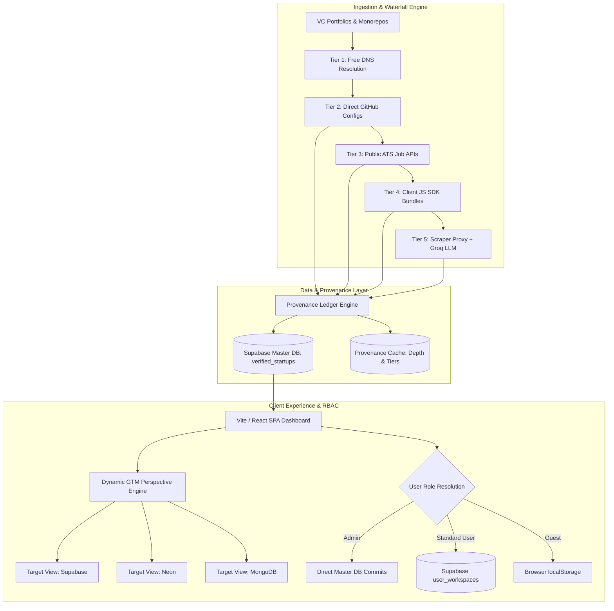
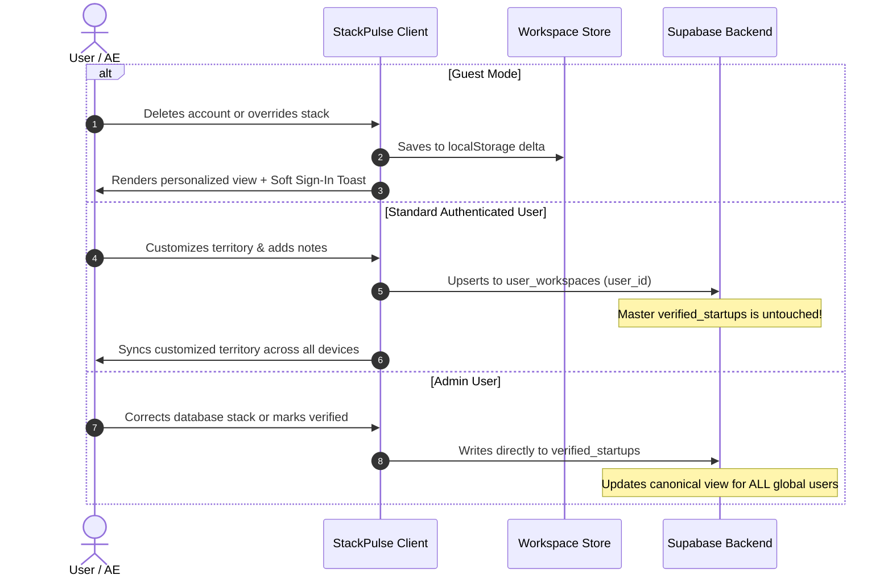

# StackPulse Enterprise System Architecture

**StackPulse** is a high-density, real-time Go-To-Market (GTM) Intelligence and Account Topology Engine built for Enterprise Infrastructure and Developer Tool teams (specifically optimized for Supabase GTM, Neon, PlanetScale, MongoDB Atlas, and ClickHouse).

It monitors **4,504 venture-backed startups** across Y Combinator, a16z Speedrun, and Sequoia Arc, extracting their internal database, caching, analytics, and vector infrastructure with high architectural fidelity.

---

## 1. High-Level System Architecture



---

## 2. The 5-Tier Zero-Cost Enrichment Waterfall

To avoid burning thousands of paid proxy credits on every company, StackPulse employs a strict **hierarchical zero-cost waterfall**:

```
┌──────────────────────────────────────────────────────────────────────────────────────────┐
│ TIER 1: DNS & Domain Resolution (0 Credits)                                              │
│ • Validates domain reachability via node:dns.                                            │
├──────────────────────────────────────────────────────────────────────────────────────────┤
│ TIER 2: Direct GitHub Monorepos (0 Credits)                                              │
│ • Fetches package.json, prisma/schema.prisma, docker-compose.yml directly from raw GH.   │
├──────────────────────────────────────────────────────────────────────────────────────────┤
│ TIER 3: Public ATS Job Boards REST API (0 Credits)                                       │
│ • Queries Ashby (api.ashbyhq.com) & Greenhouse (boards-api.greenhouse.io) REST endpoints.│
│ • Parses backend & infra requirements using Groq LLM (openai/gpt-oss-20b).              │
├──────────────────────────────────────────────────────────────────────────────────────────┤
│ TIER 4: Client-Side JS SDK Bundle Sniffing (0 Credits)                                  │
│ • Directly inspects _next/static/chunks and vendor bundles for SDK signatures:           │
│   @supabase/supabase-js, firebaseapp.com, mongodb.net, upstash, @planetscale/database.   │
├──────────────────────────────────────────────────────────────────────────────────────────┤
│ TIER 5: Scraper Proxy & Google Search (Conditional Tier)                                 │
│ • Only executed when ScraperAPI keys are provided and Tiers 1-4 return inconclusive.     │
│ • If keys are depleted: Pipeline degrades gracefully without halting.                    │
└──────────────────────────────────────────────────────────────────────────────────────────┘
```

---

## 3. Provenance Caching & Unverified Account Bifurcation

Instead of treating all unverified startups as a uniform unknown, StackPulse maintains a **deterministic Provenance Ledger**:

| Verification Depth | Description | UI Badge | GTM Actionability |
| :--- | :--- | :--- | :--- |
| **`confirmed`** | Verified database stack detected from GitHub, ATS, JS, or Google. | `[Confirmed Stack]` | Native Champion or Displacement Target. |
| **`surface_free`** | Scanned through all zero-cost tiers (GitHub/ATS/Bundles); deep scraper was skipped. | `[Surface Scanned ⚡]` | **Actionable ICP**: Eligible for 1-click on-demand verification. |
| **`deep_scraped`** | Exhaustively checked across all 6 tiers with 0 public stack found. | `[Truly Unknown 🔒]` | **Permanently Cached**: 0 credits or tokens will ever be spent on this row. |
| **`unscanned`** | In queue awaiting first pass. | `[Unscanned]` | Queued for background worker. |

---

## 4. Multi-Tenant RBAC: Canonical Master DB vs. Territory Sandboxes



---

## 5. Path-Based Routing & SPA Topology

StackPulse provides seamless **bidirectional state $\leftrightarrow$ URL synchronization**:

* **Target View Paths**:
  * `/supabase` $\rightarrow$ Evaluates all accounts from Supabase GTM lens.
  * `/neon` $\rightarrow$ Evaluates from Neon Serverless Postgres perspective.
  * `/planetscale` $\rightarrow$ Evaluates from PlanetScale Vitess MySQL perspective.
  * `/mongodb` $\rightarrow$ Evaluates from MongoDB Atlas Document DB perspective.
  * `/clickhouse` $\rightarrow$ Evaluates from ClickHouse Columnar OLAP perspective.
* **Deep-Linking**:
  * `?tab=cohorts` $\rightarrow$ Portfolio Intelligence Breakdown.
  * `?status=migration` $\rightarrow$ Filters to High-Opportunity Displacement Targets.
  * `?account=venu-ai` $\rightarrow$ Directly opens the slide-over Battlecard dossier.
* **Hosting Topology**:
  * Configured with `vercel.json` SPA rewrites forwarding all sub-paths to `/index.html`.
