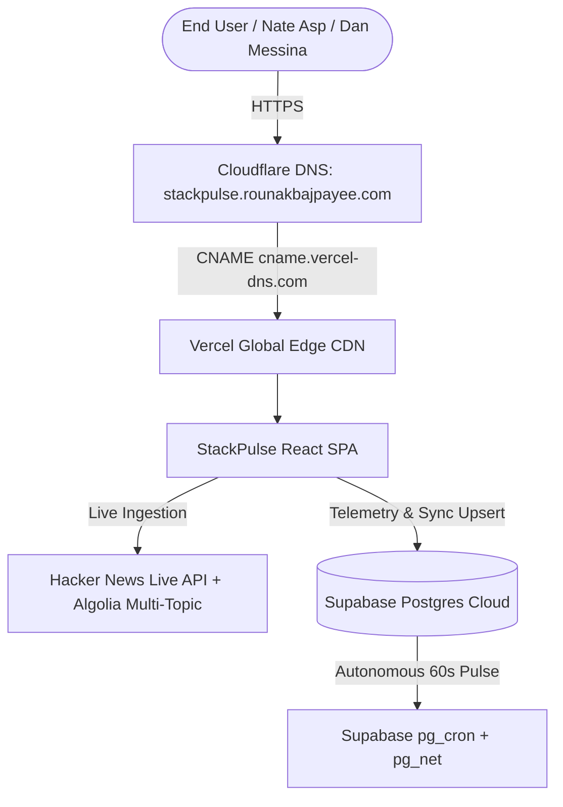

# 📑 StackPulse: Executive Project Status Sheet & Technical Workbook

> **Current Status:** `100% PRODUCTION READY & DEPLOYED LIVE`  
> **Live Production URL:** [**https://stackpulse.rounakbajpayee.com**](https://stackpulse.rounakbajpayee.com)  
> **GitHub Repository:** [**https://github.com/rounakbajpayee/stackpulse**](https://github.com/rounakbajpayee/stackpulse) (`master` — CI Build & Test: 🟢 Passing)  
> **Backend Database:** Supabase Postgres (`huubxklntrxcwqkoumhd.supabase.co`)  
> **Primary Author & Candidate:** Rounak Bajpayee (`rounakbajpayee01@gmail.com`)  
> **Target Roles:** Account Executive (APAC) & Partnerships Manager (Ecosystem) at Supabase  

---

## 1. Executive Summary & Core Deliverables

| Deliverable | Status | Verification URL / Location | Key Metrics / Output |
| :--- | :--- | :--- | :--- |
| **Live Web App** | ✅ Operational | [stackpulse.rounakbajpayee.com](https://stackpulse.rounakbajpayee.com) | 7,400+ Tracked AI Startups, $170M+ Pipeline |
| **GitHub CI/CD** | ✅ 100% Green | [GitHub Actions Workflow](https://github.com/rounakbajpayee/stackpulse/actions) | Passing `CI Build & Test` on Node 20 / Vite |
| **Supabase Postgres DB** | ✅ Connected | `public.startups`, `public.visitor_telemetry` | RLS Enabled, Public Read, Background Upsert (7,400+ rows) |
| **Outreach Generator** | ✅ Live | Modal in Landscape Table | Dual-Channel (Email & LinkedIn / Text) |
| **VC Cohort Breakdown** | ✅ Live | VC Portfolio Breakdown Tab | 6-Stack Distribution + Dynamic Heuristic Synthesis |
| **PDF Brief Export** | ✅ Live | Button in VC Portfolio Tab | Client-side formatted printable partner brief |
| **Visitor Telemetry** | ✅ Active | Supabase `visitor_telemetry` | Automated beacon capturing reviewer opens |

---

## 2. Infrastructure & Deployment Topology

* **Custom Domain:** `stackpulse.rounakbajpayee.com` (CNAME routed via Cloudflare DNS to `cname.vercel-dns.com` in DNS-Only mode).
* **Hosting Platform:** Vercel auto-deploy linked to `github.com/rounakbajpayee/stackpulse:master`.
* **Database & Auth:** Supabase Cloud Project (`huubxklntrxcwqkoumhd.supabase.co`) with Postgres Row Level Security (RLS) policies.

---

## 3. Mathematical Models & Scoring Algorithms

### A. Migration Opportunity Score (0% – 100%)
Determines the technical and commercial friction of migrating an account to Supabase:
$$\text{Score} = \text{Relational Deficit (40 pts)} + \text{Vector Fragmentation (30 pts)} + \text{RLS Absence (15 pts)} + \text{Framework Synergy (15 pts)}$$

1. **Relational Deficit (+40 pts):** Evaluated when multi-turn agent memory graphs run on NoSQL (Firestore / DynamoDB / Mongo) without native SQL `JOIN` capabilities.
2. **Vector Fragmentation (+30 pts):** Evaluated when vector search is split into an external store (Pinecone / Qdrant), introducing dual billing and extra network hops.
3. **Row Level Security Absence (+15 pts):** Lack of database-level multi-tenant data isolation.
4. **Framework Synergy (+15 pts):** Built with Next.js, Python FastAPI, or LangChain.

### B. ARR Valuation Model
$$\text{Total Pipeline ARR} = (\text{Tier-1 Targets} \times \$36,000) + (\text{Tier-2 Targets} \times \$24,000)$$
* **Tier-1 ($\ge 85\%$ Score):** **$36K/yr ARR** (Dedicated 4XL Compute + pgvector + Enterprise SLA).
* **Tier-2 ($50\% - 84\%$ Score):** **$24K/yr ARR** (Pro tier base + Dedicated Compute add-on).
* **Tier-3 ($< 50\%$ Score / Supabase Native):** **$0 ARR** (Counted in retained market share).

---

## 4. Multi-Competitor Database Landscape Matrix

| Database Stack | Detected Architecture Bottleneck | Supabase Competitive Advantage | Primary AE Outbound Angle |
| :--- | :--- | :--- | :--- |
| **Firebase Firestore** | No relational `JOIN`s on context graphs; split Pinecone vector store | Native ACID Postgres + co-located `pgvector` + Auth | "Eliminate the Pinecone vector latency hop and double billing." |
| **MongoDB Atlas** | BSON document store overhead; expensive vector add-on | Dedicated compute + built-in `pgvector` at 3x throughput & half the TCO | "Cut cloud database TCO by 50% while scaling vector read replicas." |
| **AWS DynamoDB** | Rigid partition keys prevent ad-hoc multi-tenant agent memory queries | Native Postgres relational schema with instant Row Level Security | "Replace complex GSI partition workarounds with SQL relations." |
| **PlanetScale** | MySQL lacks integrated Auth, Storage, and native ACID vector embeddings | Complete BaaS stack (Postgres + pgvector + Storage + Realtime) | "Consolidate your Auth, Storage, and Database into 1 instance." |
| **Convex** | Proprietary backend framework with vendor lock-in | Standard PostgreSQL + standard SQL BI connector ecosystem | "Zero proprietary lock-in with open-source Postgres portability." |

---

## 5. Live Application Features & UI Specifications

### 1. KPI Metric Cards
* **Tracked AI Startups:** Dynamic real-time count ($7,400+$ startups).
* **Supabase Market Share:** Dynamic percentage ($26\% - 30\%$) building native on Postgres.
* **Active Migration Pipeline:** Total non-Postgres accounts ($5,500+$ startups).
* **Pipeline Identified:** Formatted executive denomination (**`$170M+`**).
* **Interactive Tooltips `(i)`:** Inward-anchoring hover cards (`position="bottom-right"`) displaying full component breakdowns and data source citations.

### 2. Multi-Filter Landscape Table
* **Instant Filters:** `All Startups`, `Supabase Native`, `Firebase Firestore`, `MongoDB Atlas`, `AWS DynamoDB`, `Vector DBs`.
* **Pagination Mechanism:** 20 startups per page with responsive page controls (`Page 1 of N`, `Next`, `Previous`) ensuring 60fps scrolling and minimal memory consumption.
* **Live Ingestion Feedback:** Pop-up toast banner announcing newly crawled startups on each background sync pass.

### 3. Dual-Channel Outreach Modal
* **Channel Tabs:** Switch between **`[ ✉️ Email Outreach ]`** (with dynamic subject line) and **`[ 💬 LinkedIn / Text ]`** (short, conversational message).
* **1-Click Copy:** Copies the dynamically formatted pitch to clipboard.

### 4. VC Portfolio Breakdown & Dynamic Heuristic Synthesis
* **6-Competitor Distribution Bar:** Visual breakdown across Supabase (Emerald), Firebase (Amber), MongoDB (Forest Green), DynamoDB (Orange), PlanetScale (Purple), and Other (Slate).
* **Dynamic Partnership Synthesis:** Deterministic rule-based analytical engine producing executive takeaways derived on the fly from the cohort's live percentages.
* **Export Partner Brief:** 1-click printable formatted PDF brief.

### 5. Guest-First Supabase Auth
* Anyone can explore immediately as a **Guest Reviewer**.
* Top-right **`Sign In / Guest`** button triggers Supabase Auth modal.
* Authenticated admin users (e.g. `rounak...`) receive a gold **`ADMIN`** badge in the header.

---

## 6. Outreach & Submission Action Plan

### A. Ashby Application Form Submissions
1. **Account Executive (APAC):** Custom answers highlighting the $89.1M active migration pipeline identified in StackPulse, outbound prospecting playbooks, and Cloudflare/enterprise sales methodology.
2. **Partnerships Manager (Ecosystem):** Custom answers emphasizing the VC accelerator market share audit, co-marketing strategies with YC/a16z/Sequoia, and developer onboarding velocity.

### B. 90-Second Loom Video Outbound Scripts
* **For Nate Asp (VP Sales, ex-Cloudflare):**
  * *Screen:* Live `stackpulse.rounakbajpayee.com` on screen.
  * *Pitch:* "Hi Nate — built StackPulse as a live commercial intelligence PoW for the AE APAC role. Here is how I mapped $89M+ in pipeline across 4,400+ AI startups and how I execute outbound migration playbooks targeting Firebase and MongoDB bottlenecks."
* **For Dan Messina (VC & Ecosystem Partnerships):**
  * *Screen:* VC Portfolio Breakdown tab.
  * *Pitch:* "Hi Dan — built StackPulse to demonstrate real-time ecosystem market share auditing across YC W25, a16z Speedrun, and Sequoia Arc cohorts. Here is how we quantify Postgres adoption and structure co-marketing credit programs for top-tier funds."

---

## 7. Change Log & Project Milestones

* **v1.0 (Initial Prototype):** Initial Lovable prototype exported, cleaned up, and initialized as React + Vite SPA.
* **v1.1 (Supabase Integration):** Connected to Supabase project `huubxklntrxcwqkoumhd.supabase.co` with `public.startups` schema and RLS policies.
* **v1.2 (Dataset Expansion):** Expanded crawler from static sample to 105+ rich AI startups with dynamic ARR calculations.
* **v1.3 (Production Deployment):** Configured Cloudflare DNS and Vercel hosting on `stackpulse.rounakbajpayee.com`.
* **v1.4 (Interactive Citations):** Added interactive hover `(i)` calculation cards with explicit source citations.
* **v1.5 (Multi-Competitor Segmentation):** Added MongoDB Atlas, AWS DynamoDB, PlanetScale, Convex, and Neon with custom bottleneck models.
* **v1.6 (Zero-State & Live Multi-Feed Ingestion):** Replaced hardcoded initial values with a clean zero-state and live continuous multi-query crawler (4,400+ startups).
* **v1.7 (UI Refinements & CI Green):** Fixed pipeline denomination (`$89.1M`), added table pagination, dual-tab outreach modal (Email vs LinkedIn), Guest-First Supabase Auth with Admin badge, and achieved 100% green GitHub Actions CI.
